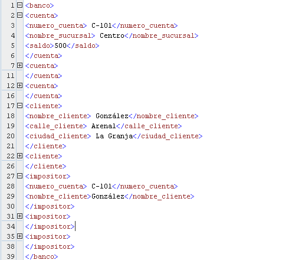

% XML
% Adolfo Sanz De Diego
% Máster UAH

# Acerca de

## Autor

- **Adolfo Sanz De Diego**
    - Blog: [asanzdiego.blogspot.com.es](http://asanzdiego.blogspot.com.es/)
    - Correo: [asanzdiego@gmail.com](mailto:asanzdiego@gmail.com)
    - GitHub: [github.com/asanzdiego](http://github.com/asanzdiego)
    - Twitter: [twitter.com/asanzdiego](http://twitter.com/asanzdiego)
    - LinkedIn: [in/asanzdiego](http://www.linkedin.com/in/asanzdiego)
    - SlideShare: [slideshare.net/asanzdiego](http://www.slideshare.net/asanzdiego/)

# Introducción a XML

## ¿Qué es?

- XML (Extensible Markup Language) es un
metalenguaje que **permite definir lenguajes
de marcado**.

- Los lenguajes de marcado permiten describir
la estructura de los contenidos de un
documento.

## Etiquetas

- Un lenguaje de marcado está formado por un
conjunto de etiquetas que se encierran entre
**corchetes angulares**, <>, y se usan en pares.

- Cada par de etiquetas delimita el comienzo y
el final de una porción de documento a la que
se refiere la etiqueta. Por ejemplo:

~~~
<asignatura>Bases de datos</asignatura>
~~~

## Ejemplo XML

## Ventajas

- Permite que la información esté autodocumentada.

- Formato no rígido pues dispone de la capacidad
de reconocer e ignorar nuevas etiquetas.

- Las etiquetas pueden aparecer varias veces
facilitando la representación de atributos
multivaluados.

- Permite el anidamiento de etiquetas.

## Ejemplo API

- <http://www.thomas-bayer.com/sqlrest/CUSTOMER/>

- <http://www.thomas-bayer.com/sqlrest/CUSTOMER/3/>

# Estructura básica

## Prologo

- Consta de dos declaraciones:

    - La declaración XML que indica **la versión de XML
utilizada y el tipo de codificación de caracteres**.
<?xml version="1.0" encoding="UTF-8"?>

    - La declaración de tipo de documento que asocia el
documento a **una DTD o XSD** respecto a la cual el
documento es conforme.

## Elementos

- Es un par de etiquetas de comienzo y final
coincidentes que delimita una **porción de
información**.

~~~
<titulo>introducción</titulo>
~~~

## Elementos vacíos

- Existen elementos vacíos que no contienen contenido.

~~~
<Nombre etiqueta/>
<Nombre etiqueta></Nombre etiqueta>
~~~

## Elementos anidados

- Los elementos **se pueden anidar**:

    - Un texto aparece en el contexto de un elemento si
aparece entre la etiqueta de inicio y final de dicho
elemento.

    - Las etiquetas se anidan correctamente si toda
etiqueta de inicio tiene un única etiqueta de
finalización coincidente que está en el contexto del
mismo elemento padre.

- Un elemento puede aparecer varias veces en un
documento XML.

## Ejemplo anidado

## Atributos

- Las etiquetas de los elementos pueden incluir 1
o más **atributos que representan propiedades**
de los elementos de la forma Nombre
atributo="Valor atributo"

~~~
<cuenta tipo_cuenta="corriente">
~~~

- Los atributos pueden aparecer solamente una
vez en una etiqueta dada.

## Mezcla

- El texto en un documento XML puede estar
mezclado con los subelementos de otro
elemento.

## Raíz

- Todo documento XML tiene **un único elemento
raíz** que engloba al resto de elementos del
documento.

- En el primer ejemplo el elemento <banco> era
la raíz.

## Comentarios

- Es un texto que se escribe **entre <!–- y -->**

- La cadena "--" no puede aparecer dentro de un
comentario.

- Los comentarios pueden aparecer en cualquier
sitio salvo dentro de declaraciones, etiquetas y
dentro de otros comentarios.

## Espacio de nombres

- Es un mecanismo que permite especificar
nombre únicos globalmente para que se usen
como marcas de elementos en los documentos
XML.

- Para ello se antepone a la etiqueta o atributo un
identificador de recursos universal. En el ejemplo
del banco podría ser
http:///www.BancoPrincipal.com

- Para abreviarlo se declaran abreviaturas del
espacio de nombres **mediante el atributo xmlns**

## Ejemplos espacio de nombres

## Varios espacios de nombres

- Un documento puede tener más de un espacio
de nombres declarado como parte del
elemento raíz, de manera que se puede asociar
**elementos diferentes con espacios de nombres
distintos**.

## Espacio de nombre predeterminado

- Se puede definir un **espacio de nombres
predeterminado** mediante el uso del atributo
xmlns en el elemento raíz.

- Los elementos sin un prefijo de espacio de
nombres explícito pertenecen entonces al
espacio de nombres predeterminado.

## CDATA

- A veces es necesario **almacenar valores que
contienen etiquetas sin que se interpreten como
etiquetas XML**, es decir como texto normal. Para
ello se usa la construcción:

~~~
<![CDATA]<cuenta>…</cuenta>]]>
~~~
