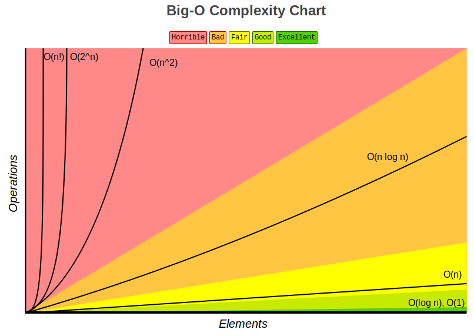
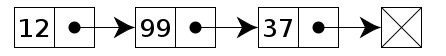
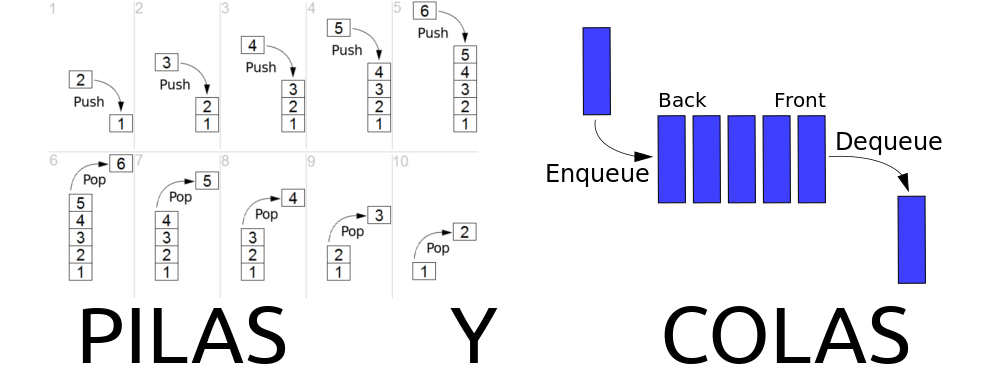
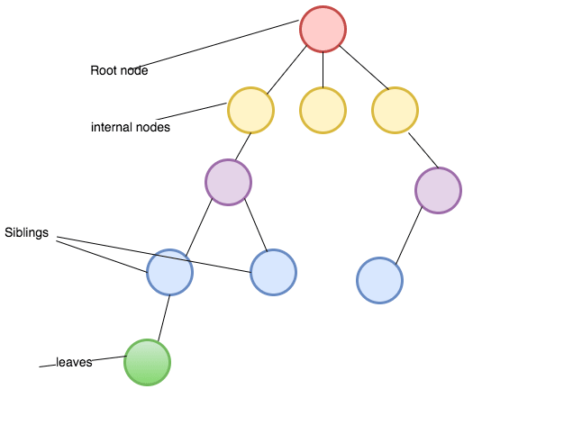
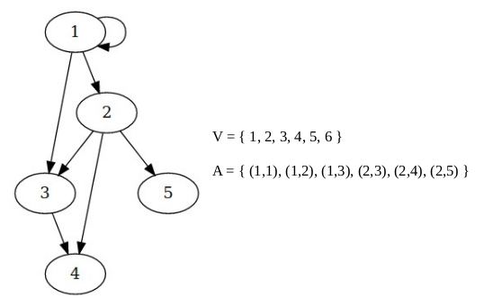

% Computación
% Adolfo Sanz De Diego
% Máster UAH

# Acerca de

## Autor

- **Adolfo Sanz De Diego**
    - Blog: [asanzdiego.blogspot.com.es](http://asanzdiego.blogspot.com.es/)
    - Correo: [asanzdiego@gmail.com](mailto:asanzdiego@gmail.com)
    - GitHub: [github.com/asanzdiego](http://github.com/asanzdiego)
    - Twitter: [twitter.com/asanzdiego](http://twitter.com/asanzdiego)
    - Linkedin: [in/asanzdiego](http://www.linkedin.com/in/asanzdiego)
    - SlideShare: [slideshare.net/asanzdiego](http://www.slideshare.net/asanzdiego/)

# Complejidad computacional

## Introducción

- La teoría de la complejidad computacional trata de **clasificar los problemas que pueden, o no pueden ser resueltos** con una cantidad determinada de recursos (tiempo y memoria).

- A grandes rasgos, teoría de la complejidad computacional trata de clasificar los problemas que pueden, o no pueden ser resueltos por una computadora.

## Máquina de Turing

- Una máquina de Turing es un dispositivo teórico que manipula símbolos sobre una tira de cinta de acuerdo a una tabla de reglas.

- Estudiando sus propiedades abstractas, ha servido de **base para mucho desarrollo teórico** en las ciencias de la computación y en la teoría de la complejidad. 

[Vídeo "¿Qué es una máquina de Turing?"](https://www.youtube.com/watch?v=iaXLDz_UeYY)

## Algoritmo

- Un algoritmo es un **conjunto prescrito de instrucciones o reglas bien definidas, ordenadas y finitas** que permiten llevar a cabo una actividad mediante pasos sucesivos que no generen dudas a quien deba hacer dicha actividad.​

- Dados un estado inicial y una entrada, siguiendo los pasos sucesivos se llega a un estado final.

[Vídeo "¿Qué es un algoritmo?"](https://www.youtube.com/watch?v=U3CGMyjzlvM)

## Tiempos polinómicos

- Cuando el tiempo de ejecución de un algoritmo se puede expresar usando una fórmula polinómica, se dice que dicho problema se puede resolver en un tiempo polinómico.

- Estos son **"buenos" algoritmos**.

## Tiempos exponenciales

- Cuando el tiempo de ejecución de un algoritmo no se puede expresar usando una fórmula polinómica, se dice que dicho problema es de tiempo exponencial.

- Cuando un problema solo se puede resolver mediante algoritmos exponenciales, **se dice que es intratable**.

## Problemas de clase NP

- La clase de complejidad NP consta de los problemas "verificables" en tiempo polinómico, es decir, dada una posible solución, esta se puede verificar en un tiempo polinómico por una máquina de Turing.

- A grandes rasgos, NP corresponde a la clase de problemas que, de manera realista, **se pueden verificar con una computadora**.

## Problemas de clase P

- La clase de complejidad P contiene a aquellos problemas que se pueden resolver en tiempo polinómico por una máquina de Turing.

- A grandes rasgos, P corresponde a la clase de problemas que, de manera realista, **se pueden resolver con una computadora**.

- Los problemas de clase P siempre son de clase NP (si lo podemos resolver en tiempo polinómico, también podemos verificarlo en tiempo polinómico).

## Problemas NP-Completo

- La clase de complejidad NP-Completo consta de los problemas "verificables" en tiempo polinómico, pero que no se ha encontrado un algoritmo que pueda resolver dicho problema en tiempo polinómico por una máquina de Turing.

- A grandes rasgos, NP-Completo corresponde a la clase de problemas que **se pueden verificar de forma sencilla, pero solo se pueden resolver por fuerza bruta**.

- Los problemas de clase NP-Completo siempre son de clase NP.

## El problema ¿P=NP?

- La pregunta ¿P=NP? es [uno de los 7 problemas del milenio](https://es.wikipedia.org/wiki/Problemas_del_milenio).

- Si P=NP, cualquier problema polinómicamente verificable (NP) se podría resolver polinómicamente (P).

- Esto quiere decir que podríamos pues resolver los problemas de clase NP-Completo de forma polinómica.

[Vídeo "¿Qué es eso del problema P versus NP?"](https://www.youtube.com/watch?v=UR2oDYZ-Sao)

## La notación O grande

- Es una notación matemática que nos **ayuda a describir el comportamiento de un algoritmo "al límite"** en función de sus elementos de entrada N.

[Vídeo "Big O Notation"](https://www.youtube.com/watch?v=v4cd1O4zkGw)

## Tipos de complejidad

| notación   | nombre             |
|------------|--------------------|
| O(1)       | constante          |
| O(log n)   | logarítmica        |
| O(n)       | lineal             |
| O(n log n) | lineal logarítmica |
| O(n^2)     | cuadrática         |
| O(2^n)     | exponencial        |
| O(n!)      | factorial          |

## Ejemplos de algoritmos

[Sorting Algorithms Animations](https://www.toptal.com/developers/sorting-algorithms)

[Algoritmos de Búsqueda en JavaScript](https://medium.com/laboratoria-developers/algoritmos-de-b%C3%BAsqueda-en-javascript-6c55e8ca5d19)

[Vídeo "Algoritmo de Dijkstra"](https://www.youtube.com/watch?v=607Y3dJGUHI)

# Estructuras de datos

## Listas enlazadas

- Una lista enlazada es una colección de nodos donde **cada nodo tiene una conexión con el siguiente** nodo.

[DataStructures: Implementation of Linked List in JavaScript](https://codeburst.io/datastructures-what-is-a-linkedlist-6840cdd5915b)

## Listas doblemente enlazadas

- En una lista doblemente enlazada, **cada nodo tiene una referencia al nodo anterior y al siguiente**.

[Doubly Linked List Implementation in JavaScript](https://codeburst.io/doubly-linked-list-implementation-in-javascript-a3df5e56869b)

## Pilas y colas

- Una **pila es un conjunto de elementos que utilizan el principio LIFO** (Last In First Out), es decir, el último elemento que introdujimos será el primero en ser retirado.

- Una **cola es un conjunto de elementos que utilizan el principio FIFO** (First In First Out), es decir, el primer elemento que introdujimos será el primero en ser retirado.

[Stacks and Queues in JavaScript](https://codeburst.io/stacks-and-queues-in-javascript-f60a9c4728d0)

## Árboles

- Un árbol es una **estructura de datos no lineal** comparada con las pilas y colas, las listas enlazadas y las matrices que son estructuras de datos lineales.

[Tree Data structure in Javascript](https://codeburst.io/tree-data-structure-in-javascript-1b4294db53aa)

# Teoría de grafos

## Grafos

- Un grafo G=(V,A) es una pareja ordenada en la que **V es un conjunto no vacío de vértices y A es un conjunto de aristas**.

[Data structures: Introduction to graphs](https://www.youtube.com/watch?v=gXgEDyodOJU)

## Grafos no dirigido

- Si A consta de **pares no ordenados de vértices**, tales como {x,y} entonces se dice que x e y son adyacentes, y en el grafo se representa mediante una línea no orientada que una dichos vértices.

## Grafos dirigido

- Si A consta de **pares ordenados de vértices**, tales como (x,y) entonces se dice que x e y es un par ordenado, y en el grafo se representa con una flecha que una dichos vértices. A este tipo de grafos se le llama dígrafo y se denota D.

## Aplicaciones

- Debido a la gran **cantidad de aplicaciones en la optimización de recorridos, procesos, flujos, algoritmos de búsquedas**, la teoría de grafos es actualmente muy usada en el campo de la informática, las ciencias de la computación y telecomunicaciones.

## Ejemplos

# Bibliografía

## Generales

[Big-O Algorithm Complexity Cheat Sheet](http://bigocheatsheet.com/)

[Curso de Khan Academy > Ciencias de la computación > Algoritmos](https://es.khanacademy.org/computing/computer-science/algorithms)

[Algorithms and data structures implemented in JavaScript with explanations and links to further readings](https://github.com/trekhleb/javascript-algorithms)

## Turing y P=NP

[Vídeo "¿Qué es un algoritmo?"](https://www.youtube.com/watch?v=U3CGMyjzlvM)

[Vídeo "¿Qué es una máquina de Turing?"](https://www.youtube.com/watch?v=iaXLDz_UeYY)

[Vídeo "¿Qué es eso del problema P versus NP?"](https://www.youtube.com/watch?v=UR2oDYZ-Sao)

## Big O

[Vídeo "Big O Notation"](https://www.youtube.com/watch?v=v4cd1O4zkGw)

[Intro to Big O Notation](https://codeburst.io/intro-to-the-big-o-ec96db047f81)

[Intro to Logarithms Big O](https://codeburst.io/intro-to-logarithms-big-o-c56a9ed840f8)

## Visualizadores

[Sorting Algorithms Animations](https://www.toptal.com/developers/sorting-algorithms)

[Vídeo "Visualization and Comparison of Sorting Algorithms"](https://www.youtube.com/watch?v=ZZuD6iUe3Pc)

[Algorithm Visualizer](http://algorithm-visualizer.org/)

[Graph Algorithm Playground](https://mikedombo.github.io/graphPlayground/)

## Algoritmos de ordenación

[Sorting algorithms beginners guide](https://codeburst.io/sorting-algorithms-beginners-guide-7b94a8e4dec)

[Bubble sort algorithm in JavaScript](https://codeburst.io/bubble-sort-algorithm-in-javascript-3f2951d227c8)

[Selection sort algorithm in javascript](https://codeburst.io/selection-sort-algorithm-in-javascript-44caa7b7cb88)

[How does merge sort algorithm works?](https://codeburst.io/how-does-merge-sort-algorithm-works-666ee0b181f6)

[Quicksort algorithm implementation](https://codeburst.io/quicksort-algorithm-implementation-8a4f81c13a0c)

[What is radix sort?](https://codeburst.io/what-is-radix-sort-7b631a1aab91)

[Lista de reproducción "Algoritmos de ordenación"](https://www.youtube.com/playlist?list=PLTd5ehIj0goPBr2ssWFrZvfE0tDTiEkIr)

## Otros algoritmos

[Algoritmos de Búsqueda en JavaScript](https://medium.com/laboratoria-developers/algoritmos-de-b%C3%BAsqueda-en-javascript-6c55e8ca5d19)

[How to implement Dijkstra’s Algorithm in JavaScript](https://hackernoon.com/how-to-implement-dijkstras-algorithm-in-javascript-abdfd1702d04)

[Vídeo "Algoritmo de Dijkstra"](https://www.youtube.com/watch?v=607Y3dJGUHI)

## Estructuras de datos

[DataStructures: Implementation of Linked List in JavaScript](https://codeburst.io/datastructures-what-is-a-linkedlist-6840cdd5915b)

[Doubly Linked List Implementation in JavaScript](https://codeburst.io/doubly-linked-list-implementation-in-javascript-a3df5e56869b)

[Stacks and Queues in JavaScript](https://codeburst.io/stacks-and-queues-in-javascript-f60a9c4728d0)

[Tree Data structure in Javascript](https://codeburst.io/tree-data-structure-in-javascript-1b4294db53aa)

[Lista de reproducción "Estructuras de datos"](https://www.youtube.com/playlist?list=PLTd5ehIj0goMTSK7RRAPBF4wP-Nj5DRvT)

[Data structures: Introduction to graphs](https://www.youtube.com/watch?v=gXgEDyodOJU)

[Grafos o Graphs en JavaScript](https://medium.com/laboratoria-developers/grafos-o-graphs-1e575c89f17)

[Árboles (trees)](https://medium.com/laboratoria-developers/%C3%A1rboles-trees-51783ba4ebe5)